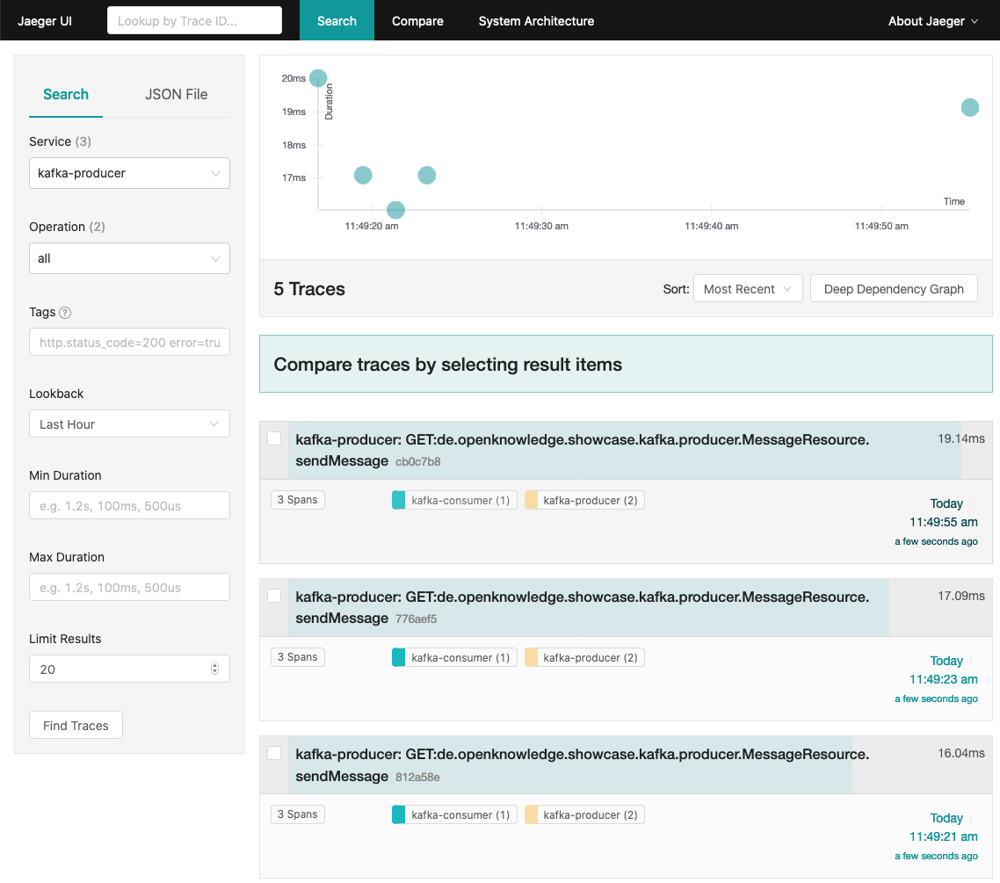

# Kafka Showcase

The showcase demonstrates Apache Kafka combined with MicroProfile Reactive Messaging, MicroProfile OpenTracing and other techniques. It 
contains a sample Java Enterprise based message producer and consumer applications using 
[MicroProfile Reactive Messaging](https://microprofile.io/project/eclipse/microprofile-reactive-messaging) to send or receive messages 
from the Kafka broker.

**Notable Features:**
* Apache Kafka broker
* Integration of MP Reactive Messaging
* Integration of MP OpenTracing
* Testcontainer tests with MicroShed, Kafka and REST-assured

## How to run

#### Step 1: Create docker images 

Software requirements to run the sample are `maven`, `openjdk-8` (or any other JDK 8) and `docker`. 
When running the Maven lifecycle it will create the war packages and use the `liberty-maven-plugin` to create a runnable JARs (fat JAR) 
which contains the application and the Open Liberty application server. The fat JARs will be copied into a Docker images using Spotify's 
`dockerfile-maven-plugin` during the package phase.

Before running the application it needs to be compiled and packaged using `Maven`. It creates the runnable JARs and Docker images.

```shell script
$ mvn clean package
```

#### Step 2: Start docker images

After creating the docker images you can start the containers. The `docker-compose.yml` file defines the containers required to run the 
showcase.  

* the Apache Zookeeper application provided by Confluent Inc.
* the Apache Kafka broker provided by Confluent Inc.
* the custom Java EE application `kafka-producer` which send messages to the Kafka topic
* the custom Java EE application `kafka-consumer` which consumes messages from the Kafka topic

To start the containers you have to run `docker-compose`:

```shell script
$ docker-compose up
```

#### Step 3: Produce and consume messages

To test the communication between the `kafka-producer` and the `kafka-consumer` application, the 
producer application a REST API that can be used to create and send your own messages. 

To send a custom message you have to send the following GET request:

```shell script
$ curl -X GET http://localhost:9080/kafka-producer/api/messages?msg=<custom message>
```


#### Step 4: Trace messages with OpenTracing and Jaeger

OpenTracing allows to trace the relationships between services in a distributed system. Sending a custom message by 
calling the REST API of the `kafka-producer` (Step 3) which is consumed by the `kafka-consumer`, will affect the generation of at least 
two traces from which the Jaeger server generates a dependency graph. The generated graph shows a connection between these two
applications.  

The UI of the Jaeger server can be accessed via http://localhost:16681/. 
 



### Resolving issues

Sometimes it may happen that the containers did not stop as expected when trying to stop the pipeline early. This may
result in running containers although they should have been stopped and removed. To detect them you need to check
Docker:

```shell script
$ docker ps -a | grep <id of the container>
```

If there are containers remaining although the application has been stopped you can remove them:

```shell script
$ docker rm <ids of the containers>
```


## Features

### MicroProfile Reactive Messaging

[MicroProfile Reactive Messaging](https://microprofile.io/project/eclipse/microprofile-reactive-messaging) is a specification providing 
asynchronous messaging support based on Reactive Streams for MicroProfile. It's implementations (e.g. 
[Smallrye Reactive Messaging](https://smallrye.io/smallrye-reactive-messaging/) which is used by Quarkus) supports Apache Kafka, AMQP, 
MQTT, JMS, WebSocket and other messaging technologies. 

Reactive Messaging can handle messages generated from within the application but also interact with remote brokers. Reactive Messaging 
Connectors interacts with these remote brokers to retrieve messages and send messages using various protocols and technology. Each 
connector is dedicated to a specific technology. For example, a Kafka Connector is responsible to interact with Kafka, while a MQTT 
Connector is responsible for MQTT interactions.

The Kafka connector adds support for Kafka to Reactive Messaging. With it you can receive Kafka Records as well as write message into Kafka. 
To use the Kafka Connector for MicroProfile Reactive Messaging you have to add the following dependencies to your `pom.xml`:

**pom.xml**
```xml
<dependency>
  <groupId>org.eclipse.microprofile.reactive.messaging</groupId>
  <artifactId>microprofile-reactive-messaging-api</artifactId>
  <version>${version.microprofile-reactive-messaging}</version>
  <scope>provided</scope>
</dependency>
<dependency>
  <groupId>io.reactivex.rxjava3</groupId>
  <artifactId>rxjava</artifactId>
  <version>${version.rxjava}</version>
</dependency>
<dependency>
  <groupId>org.apache.kafka</groupId>
  <artifactId>kafka-clients</artifactId>
  <version>${version.kafka-client}</version>
</dependency>
```

_HINT: The example shows the dependencies requirement for Open Liberty. Open Liberty provides a Kafka connector named `liberty-kafka`. If
you prefer using a different microservice framework (e.g. Quarkus) please check the documentation if special dependencies are provided._

In addition to that you have to activate the MicroProfile in your `server.xml`:

**server.xml**
```xml
<featureManager>
  ...
  <feature>mpReactiveMessaging-1.0</feature>
</featureManager>
```

#### Sending And Receiving Kafka Records

The Kafka Connector sends and retrieves Kafka Records from Kafka Brokers and maps each of them to Reactive Messaging `Messages` and vice
versa.

For the following example a Kafka broker, which is accessible at `kafka:9092` and a topic named `custom-messages` are used.


##### Sending Kafka Records

To send messages to the topic `custom-messages` an outgoing channel has to be configured in the `microprofile-config.properties` or the 
`server.xml`. If you want to set values by environment variables during the startup of the application the corresponding properties has to 
be located in the `server.xml`.

**microprofile-config.properties**
```properties
mp.messaging.outgoing.messages.connector=liberty-kafka                                                                              
mp.messaging.outgoing.messages.key.serializer=org.apache.kafka.common.serialization.StringSerializer                               
mp.messaging.outgoing.messages.value.serializer=de.openknowledge.showcase.kafka.reactive.messaging.producer.CustomMessageSerializer
```

**server.xml**
```xml
<webApplication location="kafka-producer.war" contextRoot="${app.context.root}">
    <appProperties>
        <property name="mp.messaging.connector.liberty-kafka.bootstrap.servers" value="${kafka.host}"/>
        <property name="mp.messaging.outgoing.messages.topic" value="${kafka.topic}"/>
        <property name="mp.messaging.outgoing.messages.client.id" value="${kafka.client_id}"/>
    </appProperties>
</webApplication>
```

To send messages to an outgoing channel a `org.reactivestreams.Publisher` can be used. Therefore a **non-argument** method annotated with
the annotation `@Outgoing("<channel-name>")` has to be provided. 

While generating a continuous stream of messages with a `io.reactivex.rxjava3.core.Flowable`, sending a single message seams to become a
bigger problem. You cannot pass an argument to a method providing a stream without any argument allowed. Even if combining imperative
programming and reactive seams to be tricky, there are solutions available. RxJava provides a `io.reactivex.rxjava3.core.FlowableEmitter`
which enables to add single messages to a reactive stream. 

For further information about _reactive streams_ and _RxJava_ please check the corresponding [documentation](https://github.com/ReactiveX/RxJava).

**KafkaProducer (send a single message)**
```java
package de.openknowledge.showcase.kafka.producer;

...

import org.apache.kafka.clients.producer.ProducerRecord;
import org.eclipse.microprofile.config.inject.ConfigProperty;
import org.eclipse.microprofile.reactive.messaging.Message;
import org.eclipse.microprofile.reactive.messaging.Outgoing;
import org.reactivestreams.Publisher;
import org.reactivestreams.Subscriber;
import org.reactivestreams.Subscription;
import org.slf4j.Logger;
import org.slf4j.LoggerFactory;

import javax.enterprise.context.ApplicationScoped;
import javax.inject.Inject;
import java.util.concurrent.atomic.AtomicLong;

/**
 * Kafka producer that sends messages to a kafka topic. The topic is configured in the microprofile-config.properties and server.xml.
 */
@ApplicationScoped
public class KafkaProducer {

  private static final Logger LOG = LoggerFactory.getLogger(KafkaProducer.class);

  @Inject
  @ConfigProperty(name = "mp.messaging.outgoing.messages.topic")
  private String topic;

  ...

  private Subscriber subscriber;

  private AtomicLong requested = new AtomicLong();

  public void send(final CustomMessage message) {
    LOG.info("Send message: {}", message);

    ProducerRecord<String, CustomMessage> record = new ProducerRecord<>(topic, message);

    ...

    if (requested.get() > 0) {
      subscriber.onNext(Message.of(record));
      span.finish();
    }
  }

  @Outgoing("messages") // has to be equal to outgoing channel-name in microprofile-config.properties and server.xml
  public Publisher<Message> process() {
    return subscriber -> {
      KafkaProducer.this.subscriber = subscriber;
      subscriber.onSubscribe(new Subscription() {
        @Override
        public void request(final long l) {
            KafkaProducer.this.requested.addAndGet(l);
        }

        @Override
        public void cancel() {
        }
      });
    };
  }
}
```

Kafka Records are sent as byte arrays, which requires to serialize messages. Message serialization is handled by the underlying Kafka
Client and has to be configured in the `microprofile-config.properties`.

* `mp.messaging.outgoing.[channel-name].key.serializer` to configure the key serializer (optional, default to String)
* `mp.messaging.outgoing.[channel-name].value.serializer` to configure the value serializer (mandatory)

To send as JSON, a custom serializer has to be provided.

```properties
mp.messaging.outgoing.messages.key.serializer=org.apache.kafka.common.serialization.StringSerializer
mp.messaging.outgoing.messages.value.serializer=de.openknowledge.showcase.kafka.reactive.messaging.producer.CustomMessageSerializer
```

**CustomMessageSerializer**
```java
package de.openknowledge.showcase.kafka.producer;

import org.apache.kafka.common.serialization.Serializer;

import javax.json.bind.JsonbBuilder;

/**
 * JSON serializer for the DTO {@link CustomMessage}.
 */
public class CustomMessageSerializer implements Serializer<CustomMessage> {

  @Override
  public byte[] serialize(final String topic, final CustomMessage data) {
    return JsonbBuilder.create().toJson(data).getBytes();
  }
}
```


##### Receiving Kafka Records

To retrieve messages from the topic `custom-messages`, a incoming channel has to be configured in the `microprofile-config.properties` or 
the `server.xml`. If you want to set values by environment variables during the startup of the application the corresponding properties has
to be located in the `server.xml`.

**microprofile-config.properties**
```properties
mp.messaging.incoming.messages.connector=liberty-kafka                                                                                   (2)
mp.messaging.incoming.messages.key.deserializer=org.apache.kafka.common.serialization.StringDeserializer                                 (6)
mp.messaging.incoming.messages.value.deserializer=de.openknowledge.showcase.kafka.reactive.messaging.consumer.CustomMessageDeserializer  (7)
```

**server.xml**
```xml
<webApplication location="kafka-consumer.war" contextRoot="${app.context.root}">
    <appProperties>
        <property name="mp.messaging.connector.liberty-kafka.bootstrap.servers" value="${kafka.host}"/>
        <property name="mp.messaging.incoming.messages.topic" value="${kafka.topic}"/>
        <property name="mp.messaging.incoming.messages.client.id" value="${kafka.client_id}"/>
        <property name="mp.messaging.incoming.messages.group.id" value="${kafka.group_id}"/>
    </appProperties>
</webApplication>
```

To receive messages from a incoming channel a reactive message consumer has to be implemented. Therefore a method annotated with the
annotation `@Incoming("<channel-name>")` and the expected message as a parameter has to be provided.
 
**KafkaConsumer**
```java
package de.openknowledge.showcase.kafka.consumer;

import org.apache.kafka.clients.consumer.ConsumerRecord;
import org.eclipse.microprofile.reactive.messaging.Incoming;
import org.eclipse.microprofile.reactive.messaging.Message;
import org.slf4j.Logger;
import org.slf4j.LoggerFactory;

import javax.enterprise.context.ApplicationScoped;
import java.util.concurrent.CompletableFuture;
import java.util.concurrent.CompletionStage;

/**
 * Kafka consumer that receives messages from a Kafka topic.
 */
@ApplicationScoped
public class KafkaConsumer {

  private static final Logger LOG = LoggerFactory.getLogger(KafkaConsumer.class);

  @Incoming("messages") // has to be equal to incoming channel-name in microprofile-config.properties and server.xml
  public CompletionStage onMessage(final Message message) {
    ConsumerRecord<String, CustomMessage> cr = (ConsumerRecord<String, CustomMessage>)message.unwrap(ConsumerRecord.class);

    LOG.info("Received message {}", cr.value());

    return CompletableFuture.completedFuture(null);
  }
}
```

Kafka Records are sent as byte arrays, which requires to deserialize messages. Message deserialization is handled by the underlying Kafka 
Client and has to be configured in the `microprofile-config.properties`.

* `mp.messaging.incoming.[channel-name].key.serializer` to configure the key serializer (optional, default to String)
* `mp.messaging.incoming.[channel-name].value.serializer` to configure the value serializer (mandatory)

To receive message in JSON, a custom deserializer has to be provided.

```properties
mp.messaging.incoming.messages.key.deserializer=org.apache.kafka.common.serialization.StringDeserializer
mp.messaging.incoming.messages.value.deserializer=de.openknowledge.showcase.kafka.reactive.messaging.consumer.CustomMessageDeserializer
```

**CustomMessageSerializer**
```java
package de.openknowledge.showcase.kafka.consumer;

import org.apache.kafka.common.serialization.Deserializer;

import javax.json.bind.JsonbBuilder;

/**
 * JSON deserializer for the DTO {@link CustomMessage}.
 */
public class CustomMessageDeserializer implements Deserializer<CustomMessage> {

  @Override
  public CustomMessage deserialize(String topic, byte[] data) {
    if (data == null) {
      return null;
    }
    return JsonbBuilder.create().fromJson(new String(data), CustomMessage.class);
  }
}
```


### MicroProfile OpenTracing

[OpenTracing](http://opentracing.io/) is a new, open distributed tracing standard for applications and. Developers with experience building 
microservices at scale understand the role and importance of distributed tracing: per-process logging and metric monitoring have their 
place, but neither can reconstruct the elaborate journeys that transactions take as they propagate across a distributed system. Distributed 
traces are these journeys.

The [MicroProfile OpenTracing](https://microprofile.io/project/eclipse/microprofile-opentracing) specification defines behaviors and an API
for accessing an OpenTracing compliant Tracer object within your application. The behaviors specify how incoming and outgoing requests will
have OpenTracing Spans automatically created. The API defines how to explicitly disable or enable tracing for given endpoints.

[Jaeger](https://www.jaegertracing.io) is a distributed tracing system released as open source by Uber Technologies. It is used for 
monitoring and troubleshooting microservices-based distributed systems, including distributed context propagation and transaction 
monitoring, root cause analysis, service dependency analysis and performance / latency optimization.

Further details on Opentracing for Java and Kafka can be found here:
* [jaeger-client](https://github.com/jaegertracing/jaeger-client-java)
* [java-kafka-client](https://github.com/opentracing-contrib/java-kafka-client)


The Jaeger client and the OpenTracing Kafka client add support for OpenTracing to Kafka and Reactive Messaging. With it you can trace 
all Kafka Records containing a tracing id (span) in the record header both at the producer and consumer application. The Jaeger client 
forwards the spans to the Jaeger server. To use the Jaeger client and the OpenTracing Kafka client together with MicroProfile Reactive 
Messaging you have to add the following dependencies to your `pom.xml`:

**pom.xml**
```xml
<dependency>
    <groupId>io.jaegertracing</groupId>
    <artifactId>jaeger-client</artifactId>
    <version>${version.jaeger}</version>
</dependency>
<dependency>
    <groupId>io.opentracing.contrib</groupId>
    <artifactId>opentracing-kafka-client</artifactId>
    <version>${version.opentracing-kafka-client}</version>
</dependency>
```

In addition to that you have to activate the MicroProfile in your `server.xml` and to configure the classloader.

**server.xml**
```xml
<featureManager>
  <feature>microProfile-3.3</feature> <!-- or <feature>mpOpenTracing-1.3</feature> -->
  ...
</featureManager>

<webApplication location="..." contextRoot="${app.context.root}">
    ...
    <classloader apiTypeVisibility="+third-party"/>
</webApplication>
```

#### Sending Kafka Records with Span

To send messages to the topic `custom-messages` which should be traced, a span has to be added to the Kafka record header. 

**KafkaProducer**
```java
package de.openknowledge.showcase.kafka.producer;

import io.opentracing.Span;
import io.opentracing.Tracer;

...

/**
 * Kafka producer that sends messages to a kafka topic. The topic is configured in the microprofile-config.properties and server.xml.
 */
@ApplicationScoped
public class KafkaProducer {

  private static final Logger LOG = LoggerFactory.getLogger(KafkaProducer.class);

  @Inject
  @ConfigProperty(name = "mp.messaging.outgoing.messages.topic")
  private String topic;

  @Inject
  private Tracer tracer;

  private Subscriber subscriber;

  private AtomicLong requested = new AtomicLong();

  public void send(final CustomMessage message) {
    LOG.info("Send message: {}", message);

    ProducerRecord<String, CustomMessage> record = new ProducerRecord<>(topic, message);

    Span span = this.tracer.buildSpan("send").asChildOf(this.tracer.activeSpan()).start();
    record.headers().add("uber-trace-id", span.context().toString().getBytes());

    if (requested.get() > 0) {
      subscriber.onNext(Message.of(record));
      span.finish();
    }
  }

  @Outgoing("messages")
  public Publisher<Message> process() {
    return subscriber -> { ... };
  }
}
```

#### Receiving Kafka Records with Span

To retrieve messages from the topic `custom-messages` which should be traced, the span transmitted in the Kafka record header has to be 
read from it. To receive the span from the record header, the `TracingInterceptor` is provided.

**KafkaConsumer**
```java
package de.openknowledge.showcase.kafka.consumer;

import org.apache.kafka.clients.consumer.ConsumerRecord;
import org.eclipse.microprofile.reactive.messaging.Incoming;
import org.eclipse.microprofile.reactive.messaging.Message;
import org.slf4j.Logger;
import org.slf4j.LoggerFactory;

import javax.enterprise.context.ApplicationScoped;
import java.util.concurrent.CompletableFuture;
import java.util.concurrent.CompletionStage;

/**
 * Kafka consumer that receives messages from a Kafka topic.
 */
@ApplicationScoped
public class KafkaConsumer {

  private static final Logger LOG = LoggerFactory.getLogger(KafkaConsumer.class);

  @Tracing
  @Incoming("messages") // has to be equal to incoming channel-name in microprofile-config.properties and server.xml
  public CompletionStage onMessage(final Message message) {
    ConsumerRecord<String, CustomMessage> cr = (ConsumerRecord<String, CustomMessage>)message.unwrap(ConsumerRecord.class);

    LOG.info("Received message {}", cr.value());

    return CompletableFuture.completedFuture(null);
  }
}
```

**Tracing**

The annotation `Tracing` is a CDI stereotype for a method that needs to be traced.

```java
package de.openknowledge.showcase.kafka.consumer;

import javax.interceptor.InterceptorBinding;
import java.lang.annotation.Inherited;
import java.lang.annotation.Retention;
import java.lang.annotation.Target;

import static java.lang.annotation.ElementType.METHOD;
import static java.lang.annotation.ElementType.TYPE;
import static java.lang.annotation.RetentionPolicy.RUNTIME;

/**
 * Stereotype for a method that needs to be traced
 */
@Inherited
@InterceptorBinding
@Retention(RUNTIME)
@Target({ METHOD, TYPE })
public @interface Tracing {
}
```

**TracingInterceptor**

The `TracingInterceptor` is a CDI interceptor. To register the interceptor to a specific method the `Tracing` annotation has to be added to 
it.

```java
package de.openknowledge.showcase.kafka.consumer;

import io.jaegertracing.Configuration;
import io.opentracing.Tracer;
import io.opentracing.contrib.kafka.TracingKafkaUtils;
import org.apache.kafka.clients.consumer.ConsumerRecord;
import org.eclipse.microprofile.reactive.messaging.Message;
import org.slf4j.Logger;
import org.slf4j.LoggerFactory;

import javax.interceptor.AroundInvoke;
import javax.interceptor.Interceptor;
import javax.interceptor.InvocationContext;
import java.io.Serializable;

/**
 * TracingInterceptor traces methods that are annotated by {@link Tracing}.
 */
@Tracing
@Interceptor
public class TracingInterceptor implements Serializable {

  private static final long serialVersionUID = 1L;

  private static final Logger LOG = LoggerFactory.getLogger(TracingInterceptor.class);

  private Tracer tracer = Configuration.fromEnv().getTracer();

  @AroundInvoke
  public Object trace(InvocationContext ctx) throws Exception {
    Message message = (Message)ctx.getParameters()[0];
    ConsumerRecord<String, CustomMessage> record = (ConsumerRecord<String, CustomMessage>)message.unwrap(ConsumerRecord.class);

    TracingKafkaUtils.buildAndFinishChildSpan(record, tracer);

    return ctx.proceed();
  }
}
```


### Testcontainer tests with MicroShed, Kafka and REST-assured

For the application a set of integration tests is provided. The tests bases on MicroShed combined with REST-assured. The docker container 
for the application is build by the dockerfile-maven-plugin during the package phase.

To improve the runtime of the microshed tests by avoid starting and stopping the container for every test class, the 
[shared container](https://microshed.org/microshed-testing/features/SharedContainerConfiguration.html) pattern is used.

The container is started only once when the base class is loaded. The container can then be used by all test classes which are annotated 
with `@MicroShedTest` and `@SharedContainerConfig(AbstractIntegrationTest.class)`. At the end of the test suite the Ryuk container that is 
started by Testcontainers/MicroShed will take care of stopping the singleton container.

**AppContainerConfig - Superclass for all Testcontainers tests providing the containerized application**

```java
package de.openknowledge.showcase.kafka.testing;

import org.microshed.testing.SharedContainerConfiguration;
import org.microshed.testing.testcontainers.ApplicationContainer;
import org.testcontainers.containers.GenericContainer;
import org.testcontainers.containers.KafkaContainer;
import org.testcontainers.containers.Network;
import org.testcontainers.containers.wait.strategy.Wait;
import org.testcontainers.containers.wait.strategy.WaitAllStrategy;
import org.testcontainers.junit.jupiter.Container;

import java.time.Duration;

/**
 * Provides testcontainers for integration tests.
 */
public class AppContainerConfig implements SharedContainerConfiguration {

  private static final Network NETWORK = Network.newNetwork();

  public static final String TOPIC = "messages";

  private static final String KAFKA_ALIAS = "kafka";

  @Override
  public void startContainers() {
    KAFKA.start();
    KAFKA_PRODUCER.start();
    KAFKA_CONSUMER.start();
  }

  @Container
  public static final KafkaContainer KAFKA = new KafkaContainer()
      .withNetwork(NETWORK)
      .withNetworkAliases(KAFKA_ALIAS)
      .withEnv("KAFKA_BROKER_ID", "1")
      .withEnv("KAFKA_OFFSETS_TOPIC_REPLICATION_FACTOR", "1");

  @Container
  public static final ApplicationContainer KAFKA_PRODUCER = new ApplicationContainer("kafka-showcase/kafka-producer:0")
      .withNetwork(NETWORK)
      .withNetworkAliases("kafka-producer")
      .dependsOn(KAFKA)
      .withEnv("KAFKA_HOST", KAFKA_ALIAS + ":9092")
      .withEnv("KAFKA_TOPIC", TOPIC)
      .withEnv("KAFKA_CLIENT_ID", "kafka-producer")
      .withAppContextRoot("kafka-producer")
      .waitingFor(new WaitAllStrategy().withStrategy(Wait.forHttp("/health/live"))
          .withStartupTimeout(Duration.ofMinutes(1)));

  @Container
  public static final GenericContainer KAFKA_CONSUMER = new GenericContainer<>("kafka-showcase/kafka-consumer:0")
      .withNetwork(NETWORK)
      .withNetworkAliases("kafka-consumer")
      .dependsOn(KAFKA)
      .withExposedPorts(9080)
      .withEnv("KAFKA_HOST", KAFKA_ALIAS + ":9092")
      .withEnv("KAFKA_TOPIC", TOPIC)
      .withEnv("KAFKA_CLIENT_ID", "kafka-consumer")
      .withEnv("KAFKA_GROUP_ID", "kafka-consumer")
      .waitingFor(new WaitAllStrategy().withStrategy(Wait.forHttp("/health/live"))
          .withStartupTimeout(Duration.ofMinutes(1)));
}
```

#### Integration tests with MicroShed and REST-assured

[MicroShed](https://microshed.org/microshed-testing/) is a testframework based on Testcontainers. MicroShed Testing offers a fast and 
simple way of writing and running true-to-production integration tests for Java microservice applications. Therefore MicroShed provides 
standalone Kafka producer and consumer, which allow to test the producer/consumer application separately. MicroShed Testing provides 
integration with applications using Apache Kafka for messaging. Producer/Consumer(from the Kafka Core API) annotated with a 
_KafkaConsumerClient_ or a _KafkaProducerClient_ Annotation, will send/receive messages to/from Kafka. 


[REST-assured](https://rest-assured.io/) is a popular testframework for testing and validating REST services that brings the simplicity of 
dynamic languages into the Java domain. To ease making HTTP requests to the containerized application, REST-assured provides specifications
to reuse response expectations and/or request parameters for different tests.


**ProducerIT - Integration test for the Producer Application**

```java
package de.openknowledge.showcase.kafka.producer;

import io.restassured.RestAssured;
import org.apache.kafka.clients.consumer.ConsumerRecord;
import org.apache.kafka.clients.consumer.KafkaConsumer;
import org.apache.kafka.common.serialization.StringDeserializer;
import org.junit.jupiter.api.Test;
import org.microshed.testing.SharedContainerConfig;
import org.microshed.testing.jupiter.MicroShedTest;
import org.microshed.testing.kafka.KafkaConsumerClient;

import java.time.Duration;
import java.util.ArrayList;
import java.util.List;
import java.util.UUID;

import static de.openknowledge.showcase.kafka.producer.AppContainerConfig.KAFKA_PRODUCER;
import static de.openknowledge.showcase.kafka.producer.AppContainerConfig.TOPIC;
import static org.assertj.core.api.Assertions.assertThat;

/**
 * A test class that verifies that a producer can send a message.
 */
@SharedContainerConfig(AppContainerConfig.class)
@MicroShedTest
public class ProducerIT {

  @KafkaConsumerClient(groupId = "kafka-consumer", topics = TOPIC, 
      keyDeserializer = StringDeserializer.class, valueDeserializer = TestCustomMessageDeserializer.class)
  public static KafkaConsumer<String, CustomMessage> consumer;

  @Test
  void sendMessage() throws Exception {
    // first poll throws an exception. polling twice resets the offset and fixes the problem
    consumer.poll(Duration.ofSeconds(1));

    UUID uuid = UUID.randomUUID();

    RestAssured.given()
        .queryParam("msg", uuid.toString())
        .when()
        .get("/api/messages")
        .then()
        .statusCode(202);

    List<ConsumerRecord<String, CustomMessage>> records = new ArrayList<>();
    consumer.poll(Duration.ofSeconds(30))
        .records(TOPIC)
        .forEach(records::add);

    assertThat(records).hasSize(1);
    assertThat(records.get(0).value()).isEqualTo(new CustomMessage(uuid.toString()));
  }
}
```

**ConsumerIT - Integration test for the Consumer Application**

```java
package de.openknowledge.showcase.kafka.consumer;

import org.apache.kafka.clients.producer.KafkaProducer;
import org.apache.kafka.clients.producer.ProducerRecord;
import org.junit.jupiter.api.Test;
import org.microshed.testing.SharedContainerConfig;
import org.microshed.testing.jupiter.MicroShedTest;
import org.microshed.testing.kafka.KafkaProducerClient;
import org.testcontainers.containers.output.OutputFrame;
import org.testcontainers.containers.output.WaitingConsumer;

import java.util.UUID;
import java.util.concurrent.TimeUnit;
import java.util.concurrent.TimeoutException;

import static de.openknowledge.showcase.kafka.consumer.AppContainerConfig.KAFKA_CONSUMER;
import static de.openknowledge.showcase.kafka.consumer.AppContainerConfig.TOPIC;
import static org.assertj.core.api.Assertions.assertThat;

/**
 * A test class that verifies that a consumer can receive a message.
 */
@SharedContainerConfig(AppContainerConfig.class)
@MicroShedTest
public class ConsumerIT {

  private WaitingConsumer waitingConsumer = new WaitingConsumer();

  @KafkaProducerClient(valueSerializer = TestCustomMessageSerializer.class)
  public static KafkaProducer<String, CustomMessage> producer;

  @Test
  void receiveMessage() throws TimeoutException {
    KAFKA_CONSUMER.followOutput(waitingConsumer, OutputFrame.OutputType.STDOUT);

    UUID uuid = UUID.randomUUID();

    producer.send(new ProducerRecord<>(TOPIC, new CustomMessage(uuid.toString(), "MicroShed Kafka Producer")));

    waitingConsumer.waitUntil(frame -> frame.getUtf8String()
        .contains("Received message CustomMessage{text='test', sender='MicroShed Kafka Producer'}"), 2, TimeUnit.MINUTES);

    String consumerLogs = KAFKA_CONSUMER.getLogs();
    assertThat(consumerLogs).contains("Received message CustomMessage{text='" + uuid.toString() + "', sender='MicroShed Kafka Producer'}");
  }
}
```

**TestCustomMessageSerializer - limitation**

The _KafkaProducerClient_ needs a generic Serializer for the ValueSerializer. It cannot use the CustomMessageSerializer used by the custom KafkaProducer.
This is implementation of the test serializer:

```java
public class TestCustomMessageSerializer implements Serializer<Object> {

  @Override
  public byte[] serialize(final String topic, final Object data) {
    return JsonbBuilder.create().toJson(data).getBytes();
  }
}
```


**ProducerConsumerIT - Combined integration test for the producer and the consumer application**

```java
package de.openknowledge.showcase.kafka.testing;

import io.restassured.RestAssured;
import org.junit.jupiter.api.Test;
import org.microshed.testing.SharedContainerConfig;
import org.microshed.testing.jupiter.MicroShedTest;
import org.testcontainers.containers.output.OutputFrame;
import org.testcontainers.containers.output.WaitingConsumer;

import java.util.UUID;
import java.util.concurrent.TimeUnit;
import java.util.concurrent.TimeoutException;

import static de.openknowledge.showcase.kafka.testing.AppContainerConfig.KAFKA_CONSUMER;
import static org.assertj.core.api.Assertions.assertThat;

/**
 * A test class that verifies that a consumer can receive a message send by a producer.
 */
@SharedContainerConfig(AppContainerConfig.class)
@MicroShedTest
public class ProducerConsumerIT {

  private WaitingConsumer waitingConsumer = new WaitingConsumer();

  @Test
  void sendAndReceiveMessage() throws TimeoutException {
    KAFKA_CONSUMER.followOutput(waitingConsumer, OutputFrame.OutputType.STDOUT);

    UUID uuid = UUID.randomUUID();

    RestAssured
        .given()
        .queryParam("msg", uuid.toString())
        .when()
        .get("/api/messages")
        .then()
        .statusCode(202);

    waitingConsumer.waitUntil(frame -> frame.getUtf8String()
        .contains("Received message CustomMessage{text='test', sender='Reactive Messaging Producer'}"), 2, TimeUnit.MINUTES);

    String consumerLogs = KAFKA_CONSUMER.getLogs();
    assertThat(consumerLogs).contains("Received message CustomMessage{text='" + uuid.toString() + "', sender='Reactive Messaging Producer'}");
  }
}
```